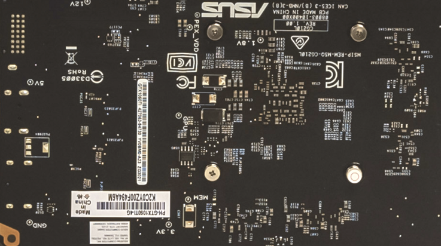
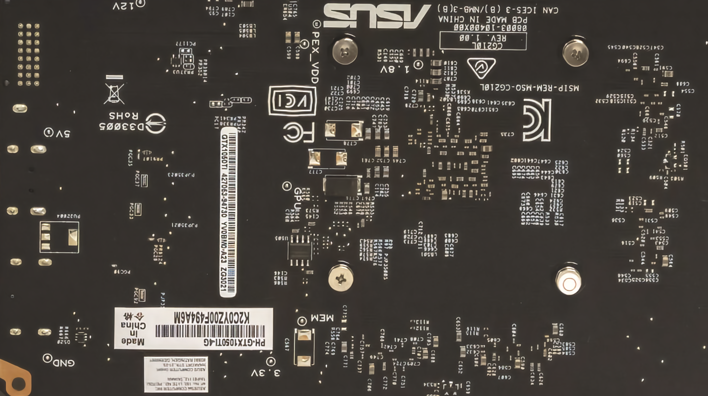

# RealSR-PyTorch

## Overview

This repository contains an op-for-op PyTorch reimplementation
of [Toward Real-World Single Image Super-Resolution: A New Benchmark and A New Model](https://openaccess.thecvf.com/content_ICCV_2019/papers/Cai_Toward_Real-World_Single_Image_Super-Resolution_A_New_Benchmark_and_a_ICCV_2019_paper.pdf)
.

## Table of contents

- [RealSR-PyTorch](#realsr-pytorch)
    - [Overview](#overview)
    - [Table of contents](#table-of-contents)
    - [Download weights](#download-weights)
    - [Download datasets](#download-datasets)
    - [How Test and Train](#how-test-and-train)
        - [Test](#test)
        - [Train RealSR_RCAN model](#train-realsr_rcan-model)
        - [Resume train RealSR_RCAN model](#resume-train-realsr_rcan-model)
    - [Result](#result)
    - [Contributing](#contributing)
    - [Credit](#credit)
        - [Toward Real-World Single Image Super-Resolution: A New Benchmark and A New Model](#toward-real-world-single-image-super-resolution-a-new-benchmark-and-a-new-model)

## Download weights

- [Google Driver](https://drive.google.com/drive/folders/17ju2HN7Y6pyPK2CC_AqnAfTOe9_3hCQ8?usp=sharing)
- [Baidu Driver](https://pan.baidu.com/s/1yNs4rqIb004-NKEdKBJtYg?pwd=llot)

## Download datasets

Contains DIV2K, DIV8K, Flickr2K, OST, T91, Set5, Set14, BSDS100 and BSDS200, etc.

- [Google Driver](https://drive.google.com/drive/folders/1A6lzGeQrFMxPqJehK9s37ce-tPDj20mD?usp=sharing)
- [Baidu Driver](https://pan.baidu.com/s/1o-8Ty_7q6DiS3ykLU09IVg?pwd=llot)

Please refer to `README.md` in the `data` directory for the method of making a dataset.

## How Test and Train

Both training and testing only need to modify the `config.py` file.

### Test

modify the `config.py`

- line 31: `model_arch_name` change to `realsr_rcan_x4`.
- line 39: `upscale_factor` change to `4`.
- line 41: `mode` change to `test`.
- line 43: `exp_name` change to `RealSR_RCAN_x4-RealSR_V3`.
- line 92: `model_weights_path` change to `./results/pretrained_models/RealSR_RCAN_x4-RealSR_V3-e52b03e4.pth.tar`.

```bash
python3 test.py
```

### Train RealSR_RCAN model

modify the `config.py`

- line 31: `model_arch_name` change to `realsr_rcan_x4`.
- line 39: `upscale_factor` change to `4`.
- line 41: `mode` change to `train`.
- line 43: `exp_name` change to `RealSR_RCAN_x4-RealSR_V3`.

```bash
python3 train.py
```

### Resume train RealSR_RCAN model

modify the `config.py`

- line 31: `model_arch_name` change to `realsr_rcan_x4`.
- line 39: `upscale_factor` change to `4`.
- line 41: `mode` change to `test`.
- line 43: `exp_name` change to `RealSR_RCAN_x4-RealSR_V3`.
- line 57: `resume_model_weights_path` change to `./results/RealSR_RCAN_x4-RealSR_V3/epoch_xxx.pth.tar`.

```bash
python3 train.py
```

## Result

Source of original paper
results: [https://openaccess.thecvf.com/content_ICCV_2019/papers/Cai_Toward_Real-World_Single_Image_Super-Resolution_A_New_Benchmark_and_a_ICCV_2019_paper.pdf](https://openaccess.thecvf.com/content_ICCV_2019/papers/Cai_Toward_Real-World_Single_Image_Super-Resolution_A_New_Benchmark_and_a_ICCV_2019_paper.pdf)

In the following table, the psnr value in `()` indicates the result of the project, and `-` indicates no test.

|     Method     | Scale | RealSR_V3 (PSNR) | RealSR_V3 (SSIM) | 
|:--------------:|:-----:|:----------------:|:----------------:|
| RealSR_RCAN_x4 |   2   | 33.87(**34.15**) | 0.922(**0.913**) | 
| RealSR_RCAN_x4 |   3   | 30.40(**31.28**) | 0.862(**0.858**) |
| RealSR_RCAN_x4 |   4   | 28.88(**29.68**) | 0.826(**0.820**) | 

```bash
# Download `RealSR_RCAN_x4-RealSR_V3-e52b03e4.pth.tar` weights to `./results/pretrained_models/RealSR_RCAN_x4-RealSR_V3-e52b03e4.pth.tar`
# More detail see `README.md<Download weights>`
python3 ./inference.py
```

Input:

<span align="center"></span>

Output:

<span align="center"></span>

```text
Build `realsr_rcan_x4` model successfully.
Load `realsr_rcan_x4` model weights `./results/pretrained_models/RealSR_RCAN_x4-RealSR_V3-e52b03e4.pth.tar` successfully.
SR image save to `./figure/baboon_lr.png`
```

## Contributing

If you find a bug, create a GitHub issue, or even better, submit a pull request. Similarly, if you have questions,
simply post them as GitHub issues.

I look forward to seeing what the community does with these models!

## Credit

### Toward Real-World Single Image Super-Resolution: A New Benchmark and A New Model

_Jianrui Cai, Hui Zeng, Hongwei Yong, Zisheng Cao, Lei Zhang_ <br>

**Abstract** <br>
Most of the existing learning-based single image superresolution (SISR) methods are trained and evaluated on simulated
datasets, where the low-resolution (LR) images are generated by applying a simple and uniform degradation (i.e., bicubic
downsampling) to their high-resolution (HR) counterparts. However, the degradations in real-world LR images are far more
complicated. As a consequence, the SISR models trained on simulated data become less effective when applied to practical
scenarios. In this paper, we build a real-world super-resolution (RealSR) dataset where paired LR-HR images on the same
scene are captured by adjusting the focal length of a digital camera. An image registration algorithm is developed to
progressively align the image pairs at different resolutions. Considering that the degradation kernels are naturally
non-uniform in our dataset, we present a Laplacian pyramid based kernel prediction network (LP-KPN), which efficiently
learns per-pixel kernels to recover the HR image. Our extensive experiments demonstrate that SISR models trained on our
RealSR dataset deliver better visual quality with sharper edges and finer textures on real-world scenes than those
trained on simulated datasets. Though our RealSR dataset is built by using only two cameras (Canon 5D3 and Nikon D810),
the trained model generalizes well to other camera devices such as Sony a7II and mobile phones.

[[Code]](https://github.com/jixiaozhong/RealSR) [[Paper]](https://openaccess.thecvf.com/content_ICCV_2019/papers/Cai_Toward_Real-World_Single_Image_Super-Resolution_A_New_Benchmark_and_a_ICCV_2019_paper.pdf) [[Code]](https://github.com/jaewon-lee-b/realsr)

```bibtex
@InProceedings{Ji_2020_CVPR_Workshops,
               author = {Ji, Xiaozhong and Cao, Yun and Tai, Ying and Wang, Chengjie and Li, Jilin and Huang, Feiyue},
               title = {Real-World Super-Resolution via Kernel Estimation and Noise Injection},
               booktitle = {The IEEE/CVF Conference on Computer Vision and Pattern Recognition (CVPR) Workshops},
               month = {June},
               year = {2020}
     }
```
